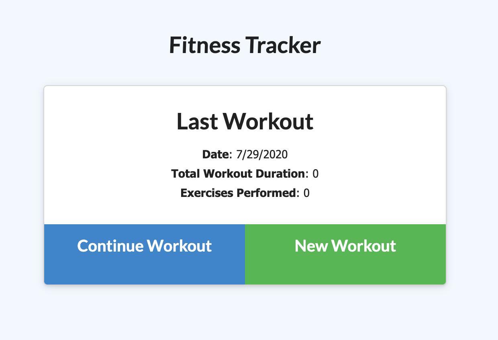
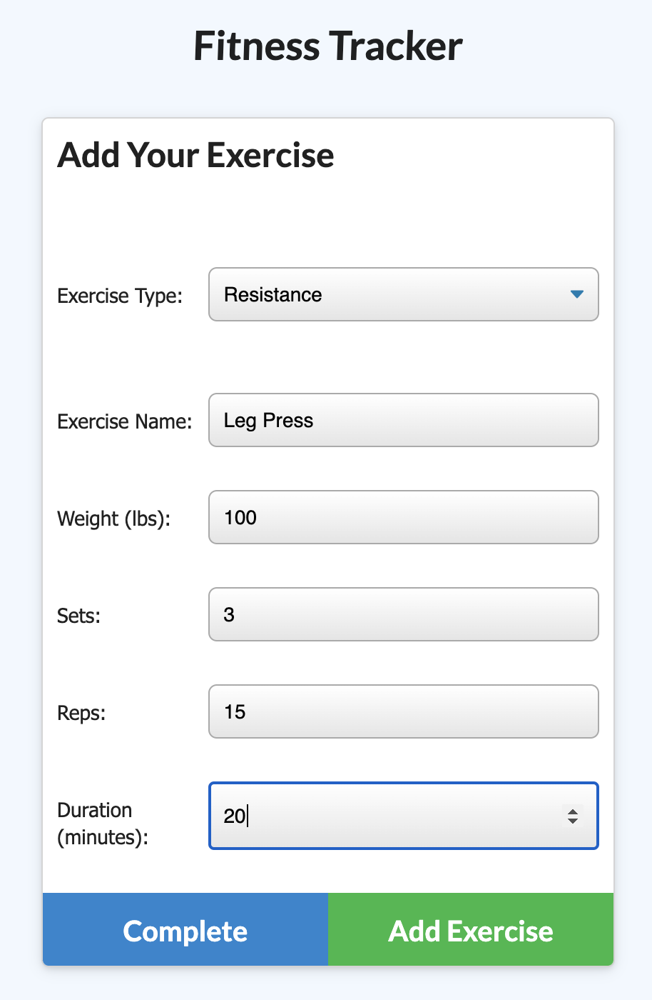
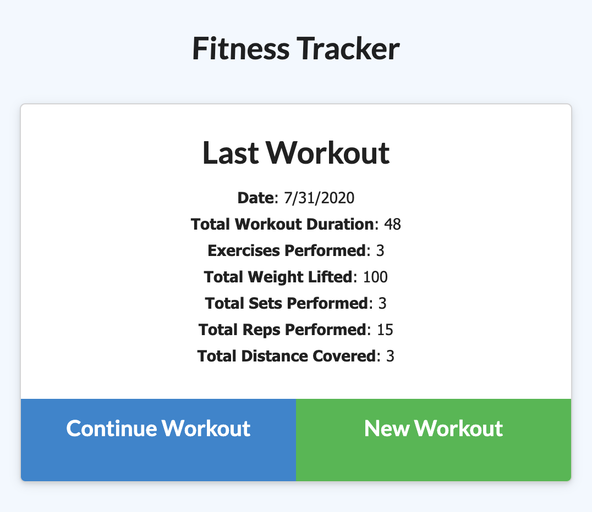
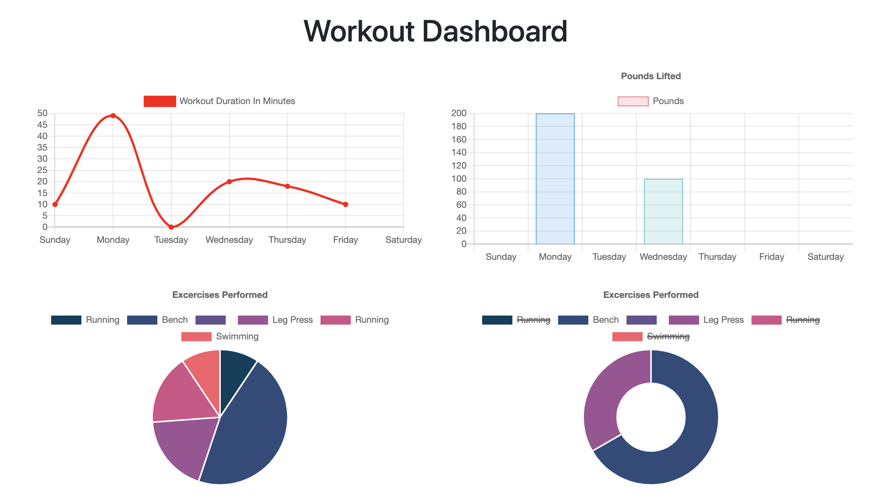

# Fitness-Tracker

## Description

This application will allow the user create, track, and graph cardio and resistance based workouts.

___

## How it Works

In order for this application to work the user will need to use the terminal to run the program or used the link available at the bottom of this ReadMe for Heroku.  If using the terminal, the user will be able to get the PORT information in order to get the localhost number to open in the browser. This can be done by runnning "node server" in the command line. Upon opening the application, the user will be brought to the homepage.
  

  

From here the user will be able to add new exercies to the workout. Pulling data from the the Workout Schema, the user will be able to fill in the the required information specific to the type of exercise that was chosen.

  

  

Once the user has addded one exercise, he/she will be able cyle through the previous process until all the exercise data has been accounted for. Each exercise is retrived from the database as a json object and pushed into the newWorkoutArray. This array allows the application to complete two for loops that allow the data to identify the specific exercise and related key:value pairs that go along with each exercie.

Once the user has added the all the desired exerices, the user will then need to select the "Complete Workout" button. When this is selected, the user will be taken back to the homepage where the data of the previous workout will be updated with the next data and displayed on the screen.

  

  

The final use of this application can be found by selecting the "Dashboard" option at the top left of the screen.

  

  

On this page the user will be able to see various charts and graphs breaking down the last recorded workout.  This data is taken from the database and set at a limit of 7 meaning that the graphs/charts will display information for the last week's workouts.

  

  

When the user is finished using the application and viewing the stats page, he/she can select the "Fitness Tracker" option from the naviagation bar and start the process over again.
___

### Links for Heroku Deployment and GitHubDeployment
 
Heroku: https://fitness-tracker12345.herokuapp.com/
  
GitHub:  https://github.com/ccraig7321/Fitness-Tracker
  
Portfolio Link: https://ccraig7321.github.io/Responsive-Portfolio/

### License

Copyright 2020 CHELSEY CRAIG

Permission is hereby granted, free of charge, to any person obtaining a copy of this software and associated documentation files (the "Software"), to deal in the Software without restriction, including without limitation the rights to use, copy, modify, merge, publish, distribute, sublicense, and/or sell copies of the Software, and to permit persons to whom the Software is furnished to do so, subject to the following conditions:

The above copyright notice and this permission notice shall be included in all copies or substantial portions of the Software.

THE SOFTWARE IS PROVIDED "AS IS", WITHOUT WARRANTY OF ANY KIND, EXPRESS OR IMPLIED, INCLUDING BUT NOT LIMITED TO THE WARRANTIES OF MERCHANTABILITY, FITNESS FOR A PARTICULAR PURPOSE AND NONINFRINGEMENT. IN NO EVENT SHALL THE AUTHORS OR COPYRIGHT HOLDERS BE LIABLE FOR ANY CLAIM, DAMAGES OR OTHER LIABILITY, WHETHER IN AN ACTION OF CONTRACT, TORT OR OTHERWISE, ARISING FROM, OUT OF OR IN CONNECTION WITH THE SOFTWARE OR THE USE OR OTHER DEALINGS IN THE SOFTWARE.

___